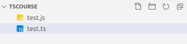
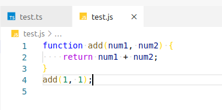

### Installing and configuring the development environment:
1. we will use [Node.js](https://nodejs.org/en/) to install and configure the development environment;
2. install __TypeScript__ using __Node Package Manager (npm)__, which is automatically installed with Node.js: ```npm install -g typescript```.
This command installs TypeScript globally on your computer, allowing you to use it in any project;
3. to work with TypeScript, I recommend using [Visual Studio Code (VS Code)](https://code.visualstudio.com/).

__Now we have everything we need to get started with TypeScript! You can create a new TypeScript file with the .ts extension and start writing code.__

```test.ts```
```html
function add(num1: number, num2: number) {
  return num1 + num2;
}
add(1, 1);
```
Let's <abbr title="converting TS format to regular JS">compile</abbr> it in the console using the command:

```tsc test.ts```.

We have a __js__ file next to the __ts__ file:



Let's open the __js__ file:



the contents of our __ts__ file were overwritten by our __js__ format.

We can also monitor file changes in real time by running the command:
```tsc test.ts -w``` or ```tsc test.ts -watch```

__Every time you save the file, it will be recompiled, if there is an error, you will immediately see it in the console.__
### Author
This repository was created and maintained by [Oleksii Shevchenko](https://shevchenkool.github.io/portfolio/). Questions, suggestions and feedback can be directed to [email](uzlabini@gmail.com) or [linkedin profile](linkedin.com/in/oleksii-shevchenko-535ab61b8).
If you have any questions or suggestions, feel free to create an [issue](https://github.com/ShevchenkoOl/phonebook/issues) or submit a [pull request](https://github.com/ShevchenkoOl/phonebook/pulls).
